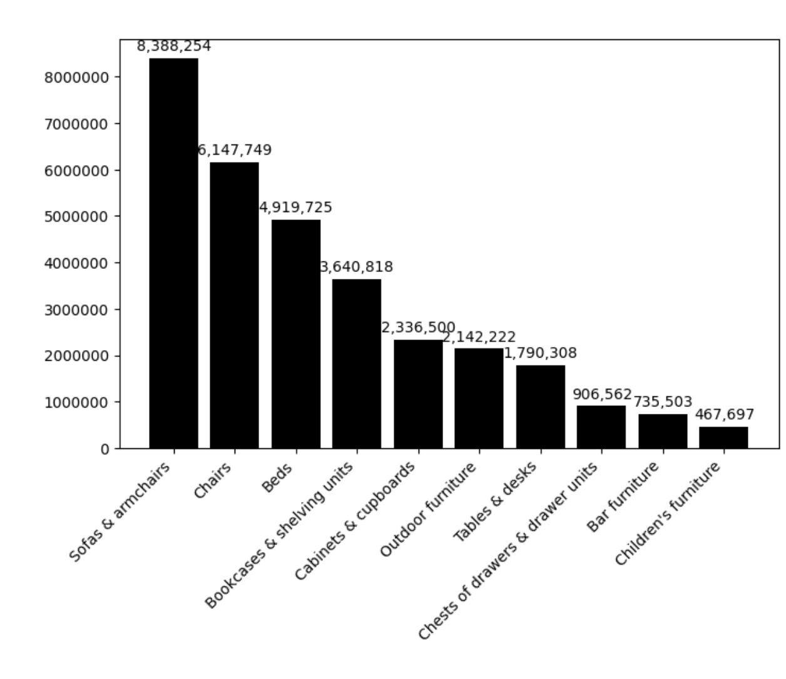
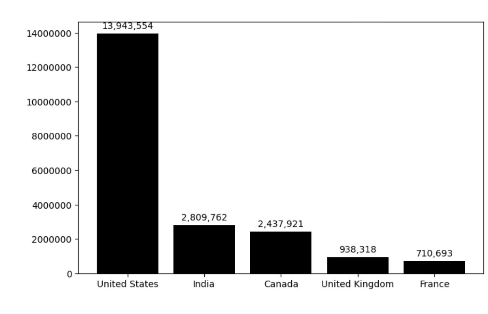
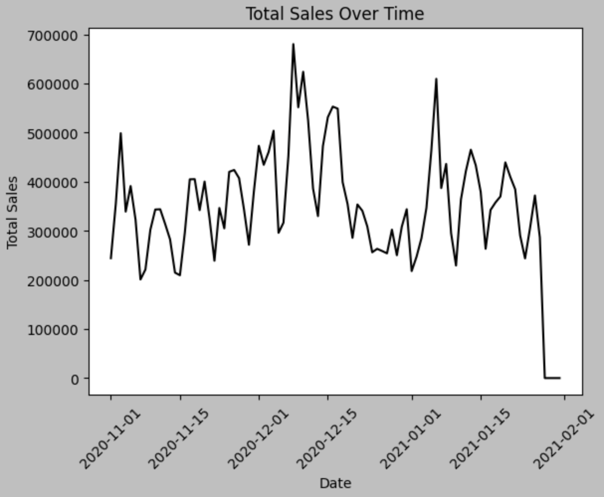
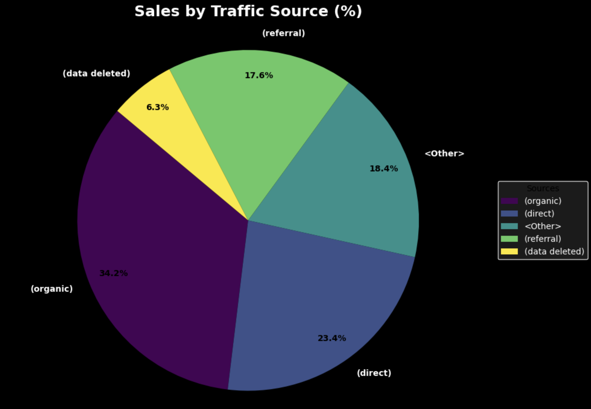
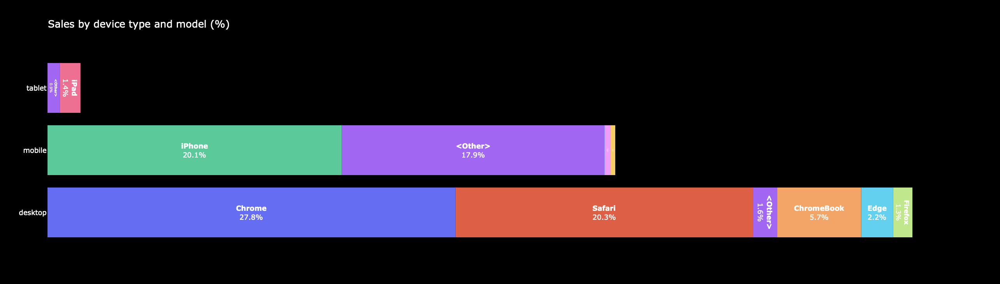

# 📊 E-commerce Sales Analytics Project

## 🚀 Project Overview
This project presents an end-to-end analysis of e-commerce sales and user behavior using SQL, Python, and Tableau.  
Data is extracted from BigQuery, processed in Python, and visualized to generate business insights.

---

## 🎯 Objectives
- Analyze sales performance across categories and countries  
- Understand user behavior and traffic sources  
- Identify key revenue drivers and trends  

---

## 🛠 Tools & Technologies
- Python (pandas, matplotlib, seaborn)  
- SQL (Google BigQuery)  
- Google Colab  
- Tableau  

---

## 📂 Project Structure
- `notebooks/` — data analysis  
- `sql/` — main query  
- `data/` — sample dataset  
- `assets/` — visualizations  

---

## 📊 Key Metrics
- Total Orders: 1330  
- Total Revenue: 1,702,129,408  
- Total Profit: 501,434,459  
- Countries Covered: 45  

---

## 📈 Visualizations

### 📊 Sales by Category

Top product categories generate the majority of revenue, indicating strong product concentration.

---

### 🌍 Revenue by Country

Sales are concentrated in a few countries, highlighting key markets.

---

### 📈 Sales Trends Over Time

Sales show clear trends over time, which can be used for forecasting and planning.

---

### 📣 Sales by Traffic Source

Traffic sources significantly impact sales performance, indicating opportunities for marketing optimization.

---

### 📱 Sales by Device Type

User behavior varies across devices, which may influence conversion rates.

---

## 📝 Key Insights
- Revenue is concentrated in a limited number of product categories  
- Certain countries dominate overall sales performance  
- Marketing channels strongly influence customer acquisition  
- Device type affects user interaction and conversion  

---

## ▶️ How to Run
1. Use BigQuery with `sql/main_query.sql`  
2. Or run notebooks using `data/sample_data.csv`  

---

## 📎 Data Source
The full dataset is stored in BigQuery due to size limitations.  
A sample dataset is provided for demonstration purposes.

---

## 📬 Author
Turchyniuk Mykhailo
